# E-Commerce Customer Behavior Analytics Using HDFS, Spark SQL, and Streamlit

Batch Processing | HDFS | Spark SQL | Streamlit | Docker

This project builds an end-to-end batch big data pipeline for analyzing historical customer behavior data from an e-commerce platform. The pipeline stores a large CSV dataset in HDFS, processes it using Spark SQL, exports analytical outputs, and visualizes the results through a Streamlit dashboard.

## 1. Architecture Diagram

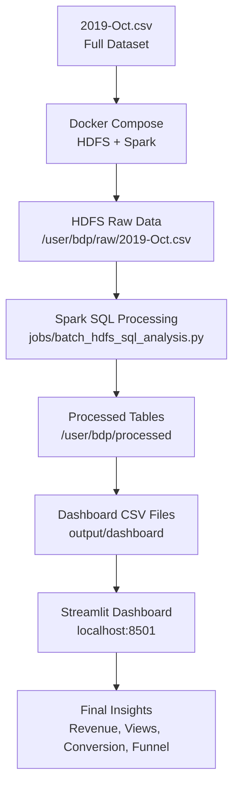

> Screenshot placeholder:
> Add HDFS Web UI or architecture screenshot here.
>
> 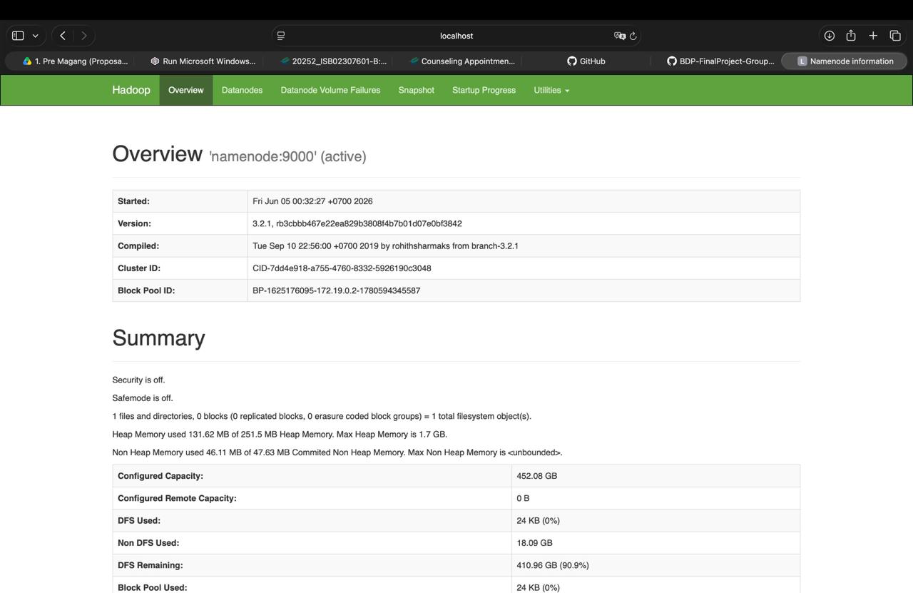

## 2. Project Description

This project analyzes historical e-commerce customer behavior data using a batch-oriented big data pipeline. The dataset contains customer events such as product views, cart additions, and purchases.

The pipeline stores the raw dataset in HDFS, processes it using Spark SQL, saves processed analytical tables back to HDFS, exports dashboard-ready CSV files, and visualizes the results through a Streamlit dashboard.

The final dashboard helps answer business questions related to product revenue, brand revenue, customer engagement, conversion rate, and customer behavior funnel.

This project focuses on batch processing rather than real-time streaming. Therefore, the dashboard visualizes processed historical metrics generated by Spark SQL, not live streaming metrics.

Tech stack:

* Docker Compose
* HDFS NameNode
* HDFS DataNode
* Apache Spark 3.5.1
* Spark SQL
* Python
* Streamlit
* Pandas
* Plotly

## 3. Problem Statement

E-commerce platforms generate large volumes of customer interaction data, including product views, cart additions, and purchases. Raw event logs are difficult to interpret directly, so they need to be processed into analytical metrics that support business decision-making.

This project answers the following batch analytical questions:

1. Which product categories generate the highest purchase revenue?
2. Which brands contribute the most to total purchase revenue?
3. What are the most viewed product categories?
4. What is the historical conversion rate from product views to purchases?
5. How do customer actions progress across the funnel: view → cart → purchase?

Because the final pipeline is batch-oriented, this project does not include a real-time metric. Instead, it focuses on historical business metrics generated from the full October 2019 dataset.

## 4. Dataset Description

This project uses the E-Commerce Behavior Data from Multi-Category Store dataset available on Kaggle.

Dataset source:

[Kaggle - E-Commerce Behavior Data from Multi-Category Store](https://www.kaggle.com/datasets/mkechinov/ecommerce-behavior-data-from-multi-category-store)

File used:

`2019-Oct.csv`

Expected local path:

`data/2019-Oct.csv`

Dataset size:

approximately 5.3GB

Important note:

The dataset is not included in this repository because of file size. Before running the project, users must manually download `2019-Oct.csv` and place it inside the `data/` folder.

For this project, the full `2019-Oct.csv` file is used as the historical batch dataset.

| Field | Description |
| --- | --- |
| `event_time` | Timestamp of when the customer event occurred |
| `event_type` | Type of customer event: view, cart, or purchase |
| `product_id` | Product identifier |
| `category_id` | Product category identifier |
| `category_code` | Product category name |
| `brand` | Product brand |
| `price` | Product price used for revenue calculation |
| `user_id` | Customer identifier |
| `user_session` | Customer session identifier |

## 5. Project Structure

```text
BDP-FinalProject-Group-1/
├── dashboard/
│   ├── app.py
│   └── requirements.txt
├── data/
│   └── 2019-Oct.csv              # local only, ignored by Git
├── jobs/
│   └── batch_hdfs_sql_analysis.py
├── screenshots/
├── docker-compose.yml
├── README.md
└── .gitignore
```

The `output/dashboard` folder will be generated automatically after running the Spark SQL batch job.

Files ignored by Git:

* `data/2019-Oct.csv`
* `output/`
* `venv/`

## 6. Prerequisites

Before running this project, make sure the following tools are installed:

* Git
* Docker Desktop
* Python 3.10 or above
* Kaggle account or access to download the dataset

Check installed tools:

```bash
git --version
docker --version
python3 --version
```

Expected output:

```text
Each command prints an installed version number.
```

Make sure Docker Desktop is running before executing Docker commands.

For Windows users, Git Bash is recommended for running the commands exactly as written. PowerShell alternatives are provided only for commands that commonly differ on Windows. If there is a line-ending issue, make sure files use LF instead of CRLF.

## 7. How to Run

### Step 1 - Clone the Repository

```bash
git clone https://github.com/KeweKiwi/BDP-FinalProject-Group-1.git
cd BDP-FinalProject-Group-1
```

Expected output:

The project folder should contain files and folders such as:

```text
docker-compose.yml
README.md
dashboard/
jobs/
screenshots/
```

Note:

If your folder name is different, use `cd` with the actual folder name.

### Step 2 - Create and Activate Python Virtual Environment

Mac/Linux:

```bash
python3 -m venv venv
source venv/bin/activate
```

Windows PowerShell:

```powershell
python -m venv venv
venv\Scripts\Activate.ps1
```

Expected output:

```text
The terminal prompt shows (venv).
```

Note:

The dashboard dependencies are listed in:

```text
dashboard/requirements.txt
```

This file contains:

```text
streamlit
pandas
plotly
```

These dependencies will be installed later before running the Streamlit dashboard, because they are only required for the dashboard layer.

### Step 3 - Download and Place the Dataset

Download the dataset from Kaggle:

[E-Commerce Behavior Data from Multi-Category Store](https://www.kaggle.com/datasets/mkechinov/ecommerce-behavior-data-from-multi-category-store)

Use this file:

```text
2019-Oct.csv
```

The file size is approximately 5.3GB, so it is not included in this GitHub repository.

Place the downloaded file inside:

```text
data/2019-Oct.csv
```

If the `data` folder does not exist, run:

```bash
mkdir -p data
```

Check the dataset:

```bash
ls -lh data/2019-Oct.csv
```

Windows PowerShell alternative:

```powershell
mkdir data
dir data\2019-Oct.csv
```

Expected output:

```text
The file exists and the size is around 5.3GB.
```

> Screenshot placeholder:
> Add screenshot showing the local dataset file.
>
> 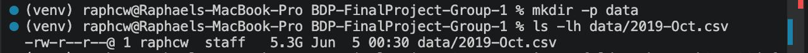

### Step 4 - Start Docker Services

```bash
docker compose up -d
```

Expected containers:

```text
bdp-namenode
bdp-datanode
bdp-spark
```

Note:

The first run may take several minutes because Docker needs to pull Hadoop and Spark images.

### Step 5 - Verify Running Containers

```bash
docker ps
```

Expected output:

The following containers should be running:

```text
bdp-namenode
bdp-datanode
bdp-spark
```

> Screenshot placeholder:
> Add screenshot of docker ps showing all containers running.
>
> 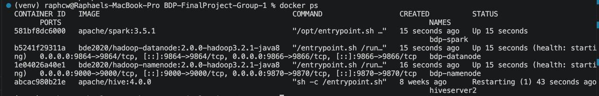

### Step 6 - Check HDFS DataNode Health

```bash
docker exec -it bdp-namenode hdfs dfsadmin -report
```

Expected output:

```text
Live datanodes (1)
```

### Step 7 - Open HDFS Web UI

Open this URL in your browser:

```text
http://localhost:9870
```

Expected output:

```text
Hadoop NameNode UI opens and shows active status / live node.
```

> Screenshot placeholder:
> Add screenshot of HDFS NameNode Web UI.
>
> 

### Step 8 - Copy Dataset to NameNode Container

```bash
docker cp data/2019-Oct.csv bdp-namenode:/2019-Oct.csv
docker exec -it bdp-namenode ls -lh /2019-Oct.csv
```

Expected output:

```text
/2019-Oct.csv exists with size around 5.3G
```

### Step 9 - Create Raw Folder in HDFS

```bash
docker exec -it bdp-namenode hdfs dfs -mkdir -p /user/bdp/raw
```

Expected output:

```text
The raw folder is created in HDFS.
```

### Step 10 - Upload Dataset to HDFS

```bash
docker exec -it bdp-namenode hdfs dfs -put -f /2019-Oct.csv /user/bdp/raw/2019-Oct.csv
```

Expected output:

```text
The upload finishes without error. This may take several minutes because the file is large.
```

### Step 11 - Verify Raw Dataset in HDFS

```bash
docker exec -it bdp-namenode hdfs dfs -ls -h /user/bdp/raw
```

Expected output:

```text
/user/bdp/raw/2019-Oct.csv
```

> Screenshot placeholder:
> Add screenshot showing 2019-Oct.csv inside HDFS raw folder.
>
> 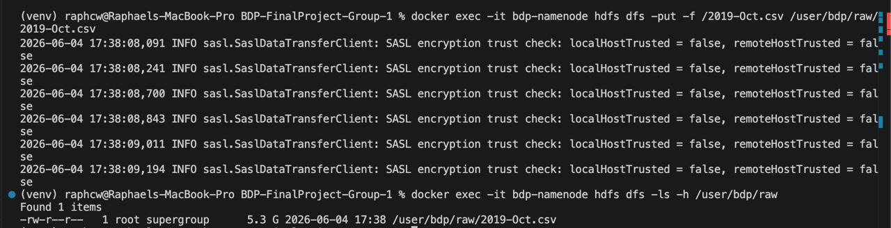

### Step 12 - Verify Spark

```bash
docker exec -it bdp-spark /opt/spark/bin/spark-submit --version
```

Expected output:

```text
Spark version 3.5.1
```

### Step 13 - Run Spark SQL Batch Processing

```bash
docker exec -it bdp-spark /opt/spark/bin/spark-submit /app/jobs/batch_hdfs_sql_analysis.py
```

Expected output:

Spark reads the raw dataset from HDFS, creates temporary views, runs Spark SQL aggregation queries, writes processed tables to HDFS, and exports CSV files for the dashboard.

Spark reads from:

```text
hdfs://namenode:9000/user/bdp/raw/2019-Oct.csv
```

Spark writes processed tables to:

```text
/user/bdp/processed
```

Spark exports dashboard CSV files to:

```text
output/dashboard
```

### Step 14 - Expected Spark Console Output

The exact Spark logs may vary depending on the environment. The important part is that the query results are printed and the message "Batch SQL Processing Completed" appears at the end.

```text
=== Dataset Schema ===
root
 |-- event_time: timestamp
 |-- event_type: string
 |-- product_id: integer
 |-- category_id: long
 |-- category_code: string
 |-- brand: string
 |-- price: double
 |-- user_id: integer
 |-- user_session: string
=== Event Type Count Table ===
view      40,779,399
cart         926,516
purchase     742,849
=== Query 1: Category Revenue Table ===
Top category: electronics.smartphone
total_revenue = $157,049,623.37
purchase_count = 338,018
=== Query 2: Brand Revenue Table ===
Top brand: apple
total_revenue = $111,209,268.82
purchase_count = 142,873
=== Query 3: Most Viewed Category Table ===
Top viewed category: electronics.smartphone
view_count = 10,619,448
=== Query 4: Conversion Rate Table ===
total_views = 40,779,399
total_purchases = 742,849
conversion_rate_percentage = 1.82
=== Query 5: Funnel Summary Table ===
view      40,779,399
cart         926,516
purchase     742,849
=== Batch SQL Processing Completed ===
```

> Screenshot placeholder:
> Add screenshot of Spark SQL console output part 1.
>
> 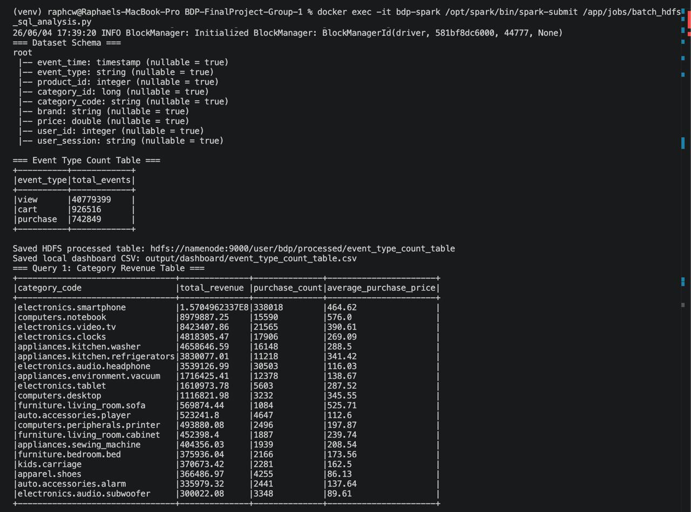

> Screenshot placeholder:
> Add screenshot of Spark SQL console output part 2 / completed message.
>
> 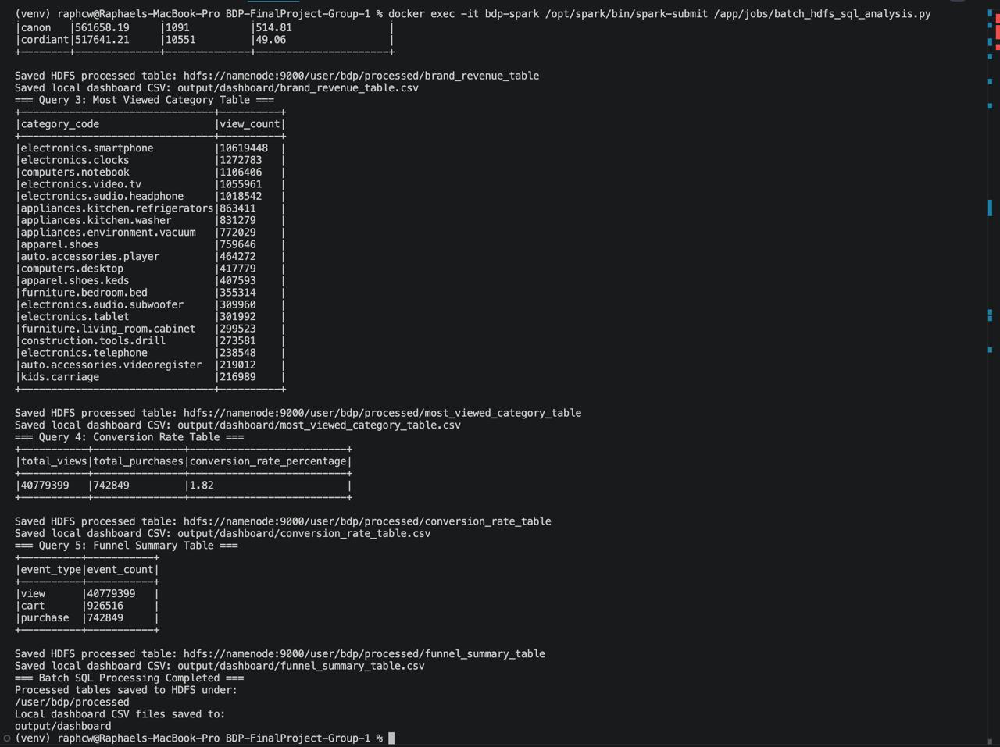

### Step 15 - Verify Processed Tables in HDFS

```bash
docker exec -it bdp-namenode hdfs dfs -ls -h /user/bdp/processed
```

Expected output:

```text
event_type_count_table
category_revenue_table
brand_revenue_table
most_viewed_category_table
conversion_rate_table
funnel_summary_table
```

> Screenshot placeholder:
> Add screenshot showing processed tables in HDFS.
>
> 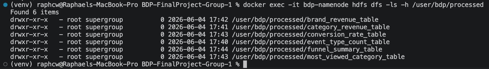

### Step 16 - Verify Local Dashboard CSV Output

```bash
ls -lh output/dashboard
```

Expected output:

```text
event_type_count_table.csv
category_revenue_table.csv
brand_revenue_table.csv
most_viewed_category_table.csv
conversion_rate_table.csv
funnel_summary_table.csv
```

If the `output/dashboard` folder does not exist yet, make sure Step 13 has completed successfully because the folder is generated by the Spark SQL batch job.

> Screenshot placeholder:
> Add screenshot showing all generated dashboard CSV files.
>
> 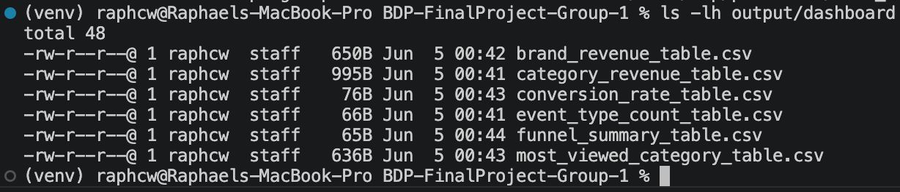

### Step 17 - Install Dependencies and Run Streamlit Dashboard

Run this step after the Spark SQL batch processing is completed and the CSV files are available under `output/dashboard`.

Install dashboard dependencies:

```bash
pip install -r dashboard/requirements.txt
```

Run the Streamlit dashboard:

```bash
streamlit run dashboard/app.py
```

Open browser:

```text
http://localhost:8501
```

Expected dashboard sections:

* Overview KPI cards
* Customer Behavior Funnel
* Revenue Analysis
* Browsing Behavior
* Event Type Distribution
* Findings Summary

> Screenshot placeholder:
> Add screenshot of dashboard overview and funnel.
>
> 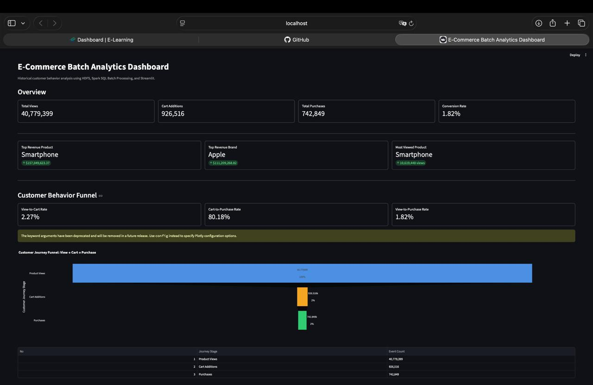

> Screenshot placeholder:
> Add screenshot of dashboard revenue analysis.
>
> 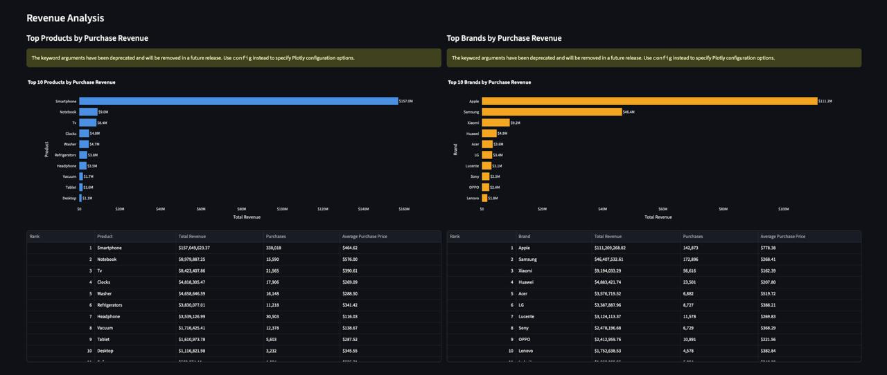

> Screenshot placeholder:
> Add screenshot of dashboard findings summary.
>
> 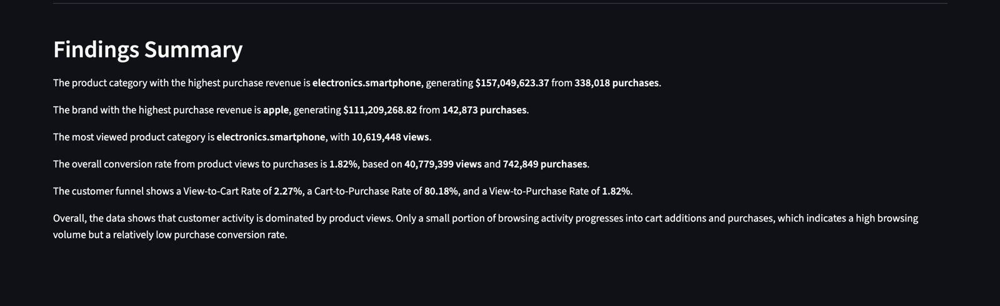

### Step 18 - Stop the Project

To stop Streamlit:

```text
CTRL + C
```

To stop Docker services:

```bash
docker compose down
```

Optional clean reset:

```bash
docker compose down -v
```

Warning:

`docker compose down -v` removes HDFS volumes. If this command is used, the dataset must be uploaded to HDFS again.

## 8. Expected Output

After following the steps, the expected outputs are:

* Raw dataset exists in HDFS at `/user/bdp/raw/2019-Oct.csv`
* Processed analytical tables exist under `/user/bdp/processed`
* Dashboard CSV files exist under `output/dashboard`
* Streamlit dashboard runs at `http://localhost:8501`

## 9. Findings & Conclusion

Final batch results from the full October 2019 dataset:

* Total views: 40,779,399
* Total cart additions: 926,516
* Total purchases: 742,849
* Top revenue category: electronics.smartphone
* Top category revenue: $157,049,623.37
* Top category purchase count: 338,018
* Top revenue brand: apple
* Top brand revenue: $111,209,268.82
* Top brand purchase count: 142,873
* Most viewed category: electronics.smartphone
* Most viewed count: 10,619,448
* Conversion rate: 1.82%

The full October 2019 dataset shows that customer behavior is highly concentrated in product viewing. The `electronics.smartphone` category dominates both revenue and views, while `apple` is the highest revenue-generating brand. The low conversion rate indicates that only a small portion of product views result in purchases.

## 10. Known Limitations

* The project uses a historical static dataset, so the dashboard is batch-based, not real-time.
* The full dataset is not included in GitHub because of file size.
* The dashboard depends on CSV files generated by the Spark SQL batch job.
* The HDFS cluster runs on a single-machine Docker Compose setup for educational purposes.
* The project is not designed as a production Hadoop cluster.

## 11. Troubleshooting

| Problem | Possible Cause | Solution |
| --- | --- | --- |
| Docker platform mismatch warning | Mac Apple Silicon uses ARM64 while Hadoop images are amd64 | Make sure `docker-compose.yml` includes `platform: linux/amd64` |
| `spark-submit` not found | `apache/spark` image does not expose `spark-submit` in PATH | Use `/opt/spark/bin/spark-submit` |
| Spark cannot connect to HDFS using localhost | `localhost` inside container refers to itself | Use `hdfs://namenode:9000` |
| HDFS upload fails | DataNode is not ready | Wait 1-2 minutes and check `hdfs dfsadmin -report` |
| Streamlit dashboard shows missing files | Spark job has not generated `output/dashboard` CSV files | Run the Spark SQL batch job first |
| Dataset file not found | `2019-Oct.csv` is not placed in `data/` | Download dataset and place it at `data/2019-Oct.csv` |

Use these exact names in commands and configuration:

```text
docker-compose.yml
spark-submit
```

## 12. GitHub Submission Notes

Files pushed to GitHub:

* `docker-compose.yml`
* `jobs/batch_hdfs_sql_analysis.py`
* `dashboard/app.py`
* `dashboard/requirements.txt`
* `README.md`
* `screenshots/`
* `.gitignore`

Files not pushed to GitHub:

* `data/2019-Oct.csv`
* `output/`
* `venv/`
* `.DS_Store`

Recommended `.gitignore` content:

```gitignore
venv/
__pycache__/
*.pyc
.DS_Store
output/
data/2019-Oct.csv
data/2019-Nov.csv
```

## 13. Reproducibility Checklist

- [ ] Repository can be cloned successfully
- [ ] Dataset is placed at `data/2019-Oct.csv`
- [ ] Python virtual environment can be created and activated
- [ ] Dashboard dependencies can be installed
- [ ] Docker services start with `docker compose up -d`
- [ ] `bdp-namenode`, `bdp-datanode`, and `bdp-spark` are running
- [ ] HDFS Web UI opens at `http://localhost:9870`
- [ ] DataNode health shows `Live datanodes (1)`
- [ ] Dataset is uploaded to `/user/bdp/raw/2019-Oct.csv`
- [ ] Spark SQL job runs using `jobs/batch_hdfs_sql_analysis.py`
- [ ] Processed tables are created under `/user/bdp/processed`
- [ ] Local dashboard CSV files are generated under `output/dashboard`
- [ ] Streamlit dashboard opens at `http://localhost:8501`
- [ ] Screenshots are saved in `screenshots/`
- [ ] `data/2019-Oct.csv`, `output/`, and `venv/` are excluded from GitHub

## 14. Screenshot Checklist

| Screenshot | File Path | Status |
| --- | --- | --- |
| Local dataset file | `screenshots/local_dataset.png` | To be added |
| Docker containers running | `screenshots/docker_ps.png` | To be added |
| HDFS Web UI | `screenshots/hdfs_web_ui.png` | To be added |
| HDFS raw dataset | `screenshots/hdfs_raw_dataset.png` | To be added |
| Spark SQL output part 1 | `screenshots/spark_sql_output_1.png` | To be added |
| Spark SQL output part 2 | `screenshots/spark_sql_output_2.png` | To be added |
| HDFS processed tables | `screenshots/hdfs_processed_tables.png` | To be added |
| Local dashboard CSV output | `screenshots/local_dashboard_csv_output.png` | To be added |
| Streamlit overview and funnel | `screenshots/streamlit_overview_funnel.png` | To be added |
| Streamlit revenue analysis | `screenshots/streamlit_revenue_analysis.png` | To be added |
| Streamlit findings summary | `screenshots/streamlit_findings_summary.png` | To be added |
